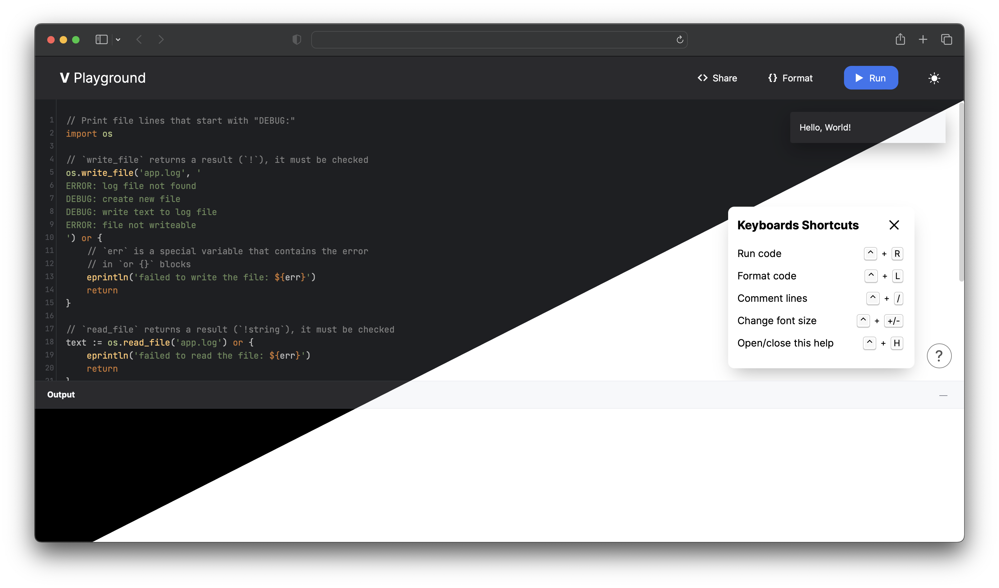

# V Playground: Run, Edit, Share V Code Online

The [V Playground](https://play.vlang.io/) is a place where you can run, edit and share V
code online.



## Features

- Nice and clean UI
- Powerful editor with syntax highlighting and auto-completion
- Ability to run test code.
- Ability to see the generated C code, for the passed V code.
- Pass compilation flags to the V compiler, and separate for your program.
- Shareable code and editor state via URL or local storage.

## Developing

If you wish to improve the playground, first you have to clone the repository:

```bash
git clone https://github.com/vlang/playground
cd playground
```

Install V dependencies:

```bash
npm run install-server-deps
```

### Quick, containerized local development (recommended)

#### Using Docker Compose

```bash
npm run run-docker
```

then access the playground at <http://localhost:5555>

### Using VSCode DevContainers

1. Install Docker
2. Install [Visual Studio Code](https://code.visualstudio.com/)
3. Install the
   [Remote Development](https://marketplace.visualstudio.com/items?itemName=ms-vscode-remote.vscode-remote-extensionpack)
   extension for VS Code
4. Clone <https://github.com/vlang/playground>
5. Create your application within a container (see gif below)

Done.

Since you are using a docker container, your main system will remain "clean".


Then just run:

```sh
npm run serve
```

then access the playground at <http://localhost:5555>

### Run the playground locally

```bash
npm run local-serve
```

then access the playground at <http://localhost:5555>

### Run the playground locally inside isolate (as on https://play.vlang.io/)

> NOTE: Only works on Linux, since it uses `isolate`.

#### Install Dependencies

> We use isolate to sandbox the playground, so you need to install it first.

```bash
git clone https://github.com/ioi/isolate /tmp/isolate
cd /tmp/isolate
make isolate isolate-check-environment
make install
```

#### Run the server

```bash
npm run serve
```

... then access the playground at <http://localhost:5555>

## Server API

See [server/README.md](./server/README.md) for more information about the server API.

## License

This project is under the **MIT License**.
See the [LICENSE](https://github.com/vlang/playground/blob/main/LICENSE)
file for the full license text.

